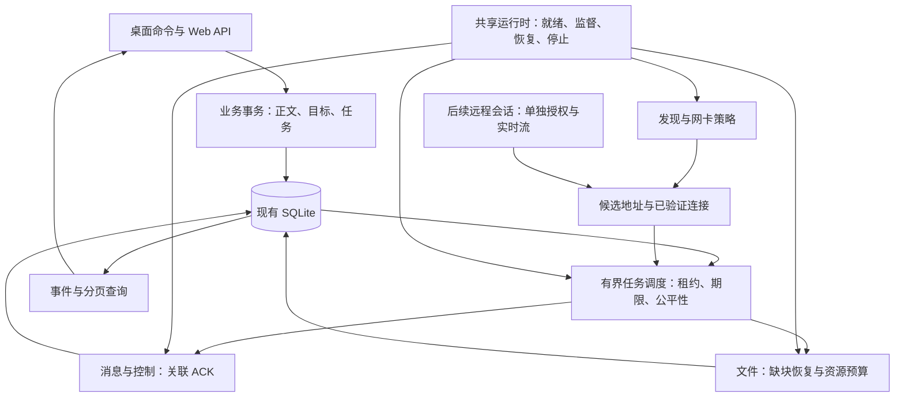

# XChat 稳定性与性能改进建议：从飞秋底层机制到现有实现

> 实施更新（2026-10-09）：阶段 1 已落地，行为与验证边界见 [阶段 1 实施与验收](stability-phase-1-implementation.md)。本文代码对照保留原分析基线。
日期：2026-10-09。源码基线：`6298408786dad1e7a8277faef49c6f872ae84fee`，XChat `0.1.13`。

本次目标是回应“XChat 总体稳定性欠佳”的使用感受，结合飞秋反编译成果，确定最值得投入的底层改进和功能方向。**首要建议是补齐现有通信核心的原子性、故障恢复、资源上限和诊断能力，再扩展远程协助。** XChat 已经有不少可靠性机制，主要工作应是把它们连成完整、可验证的闭环。

本报告是源码对照与设计建议，没有修改产品实现，也没有进行双机故障注入或吞吐实测。因此，下文区分“源码确认的行为”“由该行为推导的风险”和“建议验收目标”；不能把所有风险直接当成用户已遇到故障的根因，也不能据此声称飞秋的实测性能优于 XChat。

## 1. 建议优先做什么

P0 表示本轮稳定性建设应先处理的项目，P1 表示紧随其后的性能与可靠性改进，P2 表示依赖基础稳定后的功能扩展。这是研发顺序，不是漏洞评级。

| 顺序 | 推荐项目 | 直接解决的问题 | 投入判断 |
| --- | --- | --- | --- |
| P0-1 | 消息与收件人任务在同一事务中提交 | 已保存消息却没有可补发任务；部分群成员任务遗漏 | 中，沿用现有 SQLite 表和去重机制 |
| P0-2 | 文件任务启动恢复与执行租约 | 重启后仍显示“传输中”，实际没有执行者；恢复操作被当成重复启动 | 中至高，涉及发送、接收、取消和文件清单 |
| P0-3 | 网络服务生命周期与就绪状态 | UDP 后台退出、TCP 监听失败后，产品状态与真实服务状态脱节 | 中，桌面、移动入口和 headless 共享实现 |
| P0-4 | 当前消息回执优先、历史回执限量补发 | 回执积压拖慢新消息；单向可达时已读状态难以收敛 | 中，需保留旧版兼容和同连接回执 |
| P1-1 | 有界任务调度、错误分类与公平性 | 离线联系人、大群积压或大文件占用资源，拖慢正常聊天 | 中至高，需要混合负载验证 |
| P1-2 | 文件分块自动重试、接收端限流、带宽控制 | 一次短暂错误令整个传输失败；多发送方压垮接收设备 | 中至高，保留 v2/v3/v4 能力协商 |
| P1-3 | 减少进度写库和整工作区轮询 | 传文件时磁盘、数据库和界面同时变慢 | 中，先测 SQL 次数和耗时 |
| P1-4 | 发现与连接诊断、协议能力核验 | “看得见但发不出”、网络切换和版本降级难以解释 | 中，现有多网卡与地址核验基础较完整 |
| P2 | 远程查看，再扩展经授权的远程控制 | 局域网运维、同事协助、问题现场排查 | 高，独立会话与跨平台适配 |

**如果只启动一个改进阶段，建议选择 P0 四项，加上贯穿全程的诊断记录和故障注入测试。** 这比先增加发现方式、提高到 16 路传输或直接接入远程桌面，更能针对当前稳定性诉求产生可判断的结果。

## 2. 飞秋哪些底层设计值得吸收

飞秋依据来自本次本地样本的[反编译分析报告](../analysis/feiq-20261009/FeiQ功能分析报告.md)和[伪代码清单](../analysis/feiq-20261009/decompiled/inventory.json)。样本为 FeiQ2013 3.0.0.2，SHA-256 为 `480ff41b04bd8e93ce027b33a2d8dae9531fdf9e4651c0d728e9f490c93f1ae6`。已保存 74 个不同地址的伪代码条目，其中 36 个通过 REA 返回；完整收发协议和调度算法仍未还原。

| 可借鉴的机制 | 飞秋证据与可信边界 | 对 XChat 的实际启发 |
| --- | --- | --- |
| 把发送当作持久化任务 | `0x006145B0` 确认创建 `preautosend`、`autosended`、`contact`；含 `trytime`、`trycnt`、`status`。待发、完成、失败及取消/重发有界面证据。D3、R5 | 任务应能在进程退出、对方离线后继续管理；重点补齐原子入队、恢复和生命周期，而不是另装一个消息中间件 |
| 发现方式可配置、可诊断 | 多网卡、指定地址、其他网段与刷新选项有资源证据；端口和组播默认值、配置保存有代码证据。D1、R12 | 保留自动发现，同时解释当前接口、候选地址、连接验证和失败原因；发现成功不等于消息服务可达 |
| 文件传输作为独立任务管理 | 传输监视、缓冲区、限速、续传设置和续传数据库路径已确认。R6、S2；D2 主要确认文件选择入口 | 文件应有独立的恢复点、资源预算和可操作状态；具体并发和拥塞算法不能说成来自飞秋 |
| 远程协助具有独立生命周期 | `0x00983290` 有监听及两次 `accept`；`0x0093CE00` 有连接成功、失败和重试处理。帮助描述先查看、再授权控制。D7、R8、S5 | 远程会话应独立于聊天发送任务；可借鉴分级同意和画质/频率调节。两条连接的具体分工、授权拒绝路径尚未证明 |
| 发起操作前检查能力和状态 | 语音入口 `0x005DE410` 检查对端兼容性、屏蔽标志、音频设备和忙碌状态。D8 | 对文件、远程协助统一做能力协商、设备可用性和忙碌判断，减少启动后才失败 |
| 提供任务与数据维护入口 | 自动发送管理、历史检索/维护、配置与记录备份有资源证据。R5、R13、R15 | “可看见为什么失败、可继续、可清理、可恢复”本身就是可靠性功能 |

飞秋的 ACK 关联方式、退避间隔、严格去重、连接池、文件校验算法和限流实现没有完整代码证据。本报告后续提出的事务 outbox、分块重试、公平调度等具体方案，是依据 XChat 源码缺口提出的工程设计，不能包装成已经还原的飞秋算法。

## 3. XChat 已经有哪些基础

当前源码比仓库说明中的旧结构更进一步：`package.json` 为 React 19.2.8 / Vite 8.1.5，主前端在 `frontend/src/`；后端仍为共享 Rust 核心、Tauri 和 Axum。仓库也已有消息可靠性和文件传输测试，不能沿用旧说明中“没有前端构建和 Rust 测试”的判断。这里只记录差异，本次不改动仓库规则。

| 用户关注方向 | 当前实现已具备 | 本次推荐补强点 |
| --- | --- | --- |
| 局域网发现 | 指定接口定向广播和组播、网卡分类/开关、固定地址、DNS 与退避、网络变化后的重新发现、地址候选与 UUID 核验 | 运行时健康、就绪顺序、网络切换后的统一恢复、可解释诊断、版本能力核验 |
| 消息队列 | `messages`、`message_receipts`、`message_delivery_attempts` 持久化；原子领取、60 秒执行租约、分级退避与抖动、每 2 秒补发扫描 | 原子入队边界、任务公平性、过期/取消策略、积压上限、按到期任务调度 |
| 发送稳定性 | 稳定消息 ID、重复内容冲突检查、同连接关联 ACK、5 秒 ACK 超时、迟到 ACK 不回退、群同步与消息同连接顺序发送 | 历史回执不阻塞当前消息、已读回执优先级、旧接口语义统一、故障后的状态收敛 |
| 文件发送性能 | v1 顺序分块，v2/v3/v4 并行协商，4/8/16 路配置；v4 传输与摘要计算重叠；流式读取、缺块恢复、最终 SHA-256、合并时同步计算摘要 | 重启接管、瞬时错误自动重试、接收/磁盘/摘要总预算、进度批量写库、混合负载性能 |
| 远程协助/控制 | 已有本地截图、编辑和贴图基础；在当前协议、命令与主前端中未发现完整远程协助会话 | 新增独立会话、授权与能力协商、屏幕流及控制适配，分阶段实现 |

关键源码入口：发现见 [discovery.rs](../src-tauri/src/network/discovery.rs#L1711) 和 [discovery_policy.rs](../src-tauri/src/network/discovery_policy.rs#L488)；投递见 [workspace.rs](../src-tauri/src/workspace.rs#L1121)、[db.rs](../src-tauri/src/db.rs#L2691)；文件见 [conversation_file.rs](../src-tauri/src/network/conversation_file.rs#L1522)。

## 4. 优先核实和修复的底层风险

### 4.1 消息正文与投递目标分两次事务提交

**源码事实。** `workspace::send_message` 先调用 `save_conversation_message`，再调用 `ensure_message_recipients`；二者各自开启并提交事务。进程内的 `MESSAGE_WRITE_LOCK` 只能避免并行请求互相穿插，不能把两次数据库提交变成一次原子操作。补发查询以 `messages JOIN message_receipts` 为基础，缺少收件人记录的正文不会被这个查询选中。

定位：[workspace.rs:1253](../src-tauri/src/workspace.rs#L1253)、[db.rs:2396](../src-tauri/src/db.rs#L2396)、[db.rs:2848](../src-tauri/src/db.rs#L2848)、[db.rs:2822](../src-tauri/src/db.rs#L2822)。文件发送在保存消息、补充文件元信息、写收件人和逐个创建传输任务之间也分多次提交：[conversation_file.rs:432](../src-tauri/src/network/conversation_file.rs#L432)。

**风险推导。** 若在正文提交后、目标事务提交前崩溃，或第二次提交失败，会出现“有聊天记录、没有完整投递任务”的状态。重复使用原 ID 手动提交可能修复它，但当前自动补发链没有覆盖这个空窗。

**建议。** 以现有表为基础增加一个业务事务入口，一次提交正文、发送时的收件人快照、必要的文件任务和初始投递状态。事务成功后才向调用方确认已在本机受理；网络发送在提交之后启动。对历史孤立记录做一次有规则的检测与修复；群收件人不能直接用恢复时的最新群成员代替发送时快照。

**验证。** 在每个写入边界注入失败并重启，结果只能是“完全未受理”或“有完整可恢复任务”。重复提交同一 ID 只产生一条逻辑消息。

### 4.2 文件任务持久化了状态，尚需完整的重启接管

**源码事实。** `resume_waiting_for_peer` 只查询 `waiting_peer`。`run_upload` 只接受 `queued` 或 `waiting_peer` 开始执行。手动 `resume_transfer` 遇到 `queued`、`transferring`、`cancelling` 等状态会报告任务已活动。检查桌面、移动和 headless 初始化路径，未见启动时统一接管这些遗留状态的恢复步骤。

定位：[conversation_file.rs:508](../src-tauri/src/network/conversation_file.rs#L508)、[conversation_file.rs:622](../src-tauri/src/network/conversation_file.rs#L622)、[conversation_file.rs:1101](../src-tauri/src/network/conversation_file.rs#L1101)、[main.rs:348](../src-tauri/src/main.rs#L348)、[lib.rs:221](../src-tauri/src/lib.rs#L221)、[server_main.rs:52](../src-tauri/src/server_main.rs#L52)。

**风险推导。** 杀进程后，数据库中的“传输中”可能继续存在，内存中的执行任务和取消令牌却已经消失。这里缺的是自动接管机制，不是分块续传本身。当前取消接口确有处理“找不到内存令牌”的兜底，不能说用户完全无法处理遗留任务：[workspace.rs:1938](../src-tauri/src/workspace.rs#L1938)。

**建议。** 为传输增加执行者租约/进程世代和受控状态迁移。启动时扫描非终态：失去执行者的发送任务进入可恢复状态；接收任务用已提交的分块清单与实际文件重建进度；`cancelling` 完成清理；`awaiting_acceptance` 保持等待同意。源文件不存在、授权失效或内容变化应成为明确的暂停原因。

恢复必须先确认没有仍在运行的执行者，再重新领取任务。复用消息管线已有的租约思路，避免多个唤醒入口重复启动文件任务。

**验证。** 在排队、发送一半、合并、最终文件发布以及完成回执前后分别退出并重启；任务最终必须完成或进入可解释的可操作状态，不能永远显示有进度但没有执行者。

### 4.3 网络后台任务缺少统一的启动就绪与健康管理

**源码事实。** `main.rs`、`lib.rs`、`server_main.rs` 分别创建发现监听、广播、离线扫描和 HTTP 服务任务，相关 `JoinHandle` 未交给统一监督者。UDP 创建监听失败后记录日志并返回；HTTP 绑定和 `serve` 使用 `unwrap`。广播启动也可能在创建 socket 失败时返回。

定位：[main.rs:348](../src-tauri/src/main.rs#L348)、[lib.rs:238](../src-tauri/src/lib.rs#L238)、[server_main.rs:60](../src-tauri/src/server_main.rs#L60)、[discovery.rs:1859](../src-tauri/src/network/discovery.rs#L1859)、[web_server.rs:565](../src-tauri/src/web_server.rs#L565)。

**风险推导。** 后台服务失败不能稳定地转化为统一的产品健康状态；不同入口也容易在后续修复中产生行为差异。TCP 绑定失败属于 panic 路径，具体是否终止整个应用取决于构建的 panic 配置，不应笼统描述成只损失一个后台线程。

**建议。** 建立共享网络运行时：先绑定并确认必需的监听器，再宣告服务可用；集中保存任务句柄、停止令牌、启动结果和最后错误。对可恢复的接口变化做有限退避重建；端口占用、配置无效要返回可诊断状态。健康检查分别展示“发现服务”“消息/文件监听”“数据库”“恢复调度器”，避免用一个在线灯代表全部链路。

这项是依据 XChat 入口结构提出的可靠性改造；没有证据表明飞秋采用同一种监督实现。

### 4.4 历史回执补发位于当前消息处理之前

**源码事实。** WebSocket 每收到带 `from_id` 的帧，先 `await flush_pending_receipts`，之后才处理当前协议或正文。查询返回该作者全部待发回执，未分页。回送队列容量为 64；发送任务同时处理广播与回执，写 socket 未设置显式期限。同连接回送故意不标记已发，以兼容旧对端。

定位：[web_server.rs:2697](../src-tauri/src/web_server.rs#L2697)、[web_server.rs:3340](../src-tauri/src/web_server.rs#L3340)、[db.rs:3236](../src-tauri/src/db.rs#L3236)、[web_server.rs:2073](../src-tauri/src/web_server.rs#L2073)。

**风险推导。** 当反向连接不可达、历史回执持续积压，或对端读取缓慢时，补发会竞争带宽和队列，延迟当前正文落库。另一个具体分支是：一条记录同时需要补送达和已读回执时，`flush_pending_receipts` 的 `if / else if` 优先送达；若送达一直不能标记完成，同连接补发会持续选择送达，已读可能被延后。反向补发路径仍存在，因此这是特定网络条件下的风险，不是所有已读回执都失效。

**建议。** 当前正文持久化后，优先发送其关联 ACK；历史回执交给独立、有界、可合并的后台批次。允许最高状态的 `ReadAck` 同时表达已送达；保留幂等重发，但限制每轮条数和时间。写 socket 设置期限，队列饱和时保留数据库任务、关闭异常连接并重试。撤回等控制指令也应区分“写出”和“对端已处理”，升级协议时增加关联确认。

**验证。** 构造仅发送端能主动连通接收端的网络，预置大量未确认回执，再发送新消息并已读；检查正文延迟、回执收敛和内存上限。

### 4.5 文件瞬时故障会直接结束本轮任务

**源码事实。** `upload_parallel_range` 对一块只执行一次 HTTP 上传；任一块失败，`upload_parallel_chunks` 返回失败，`run_upload` 保存终态。后续可以人工重试，且并行协议会查询缺块，因此不是完全不支持续传。并行 HTTP 客户端的总请求超时为一小时，当前路径没有独立的无进展超时。

定位：[conversation_file.rs:1747](../src-tauri/src/network/conversation_file.rs#L1747)、[conversation_file.rs:1522](../src-tauri/src/network/conversation_file.rs#L1522)、[conversation_file.rs:1101](../src-tauri/src/network/conversation_file.rs#L1101)。

**建议。** 对连接重置、超时、临时繁忙设置有次数/时长上限的分块重试，失败后先询问接收端该块是否已提交；权限、身份、协议冲突、源文件变化等错误进入暂停或终止。区分连接超时、无进展超时和整任务期限；网络恢复时重选并核验地址，再继续缺块。

重试不能简单重复执行 `progress.fetch_add`：需要区分当前尝试读取的字节、已得到分块确认的字节和已经校验的最终文件，撤销失败尝试的显示进度。

### 4.6 发送并发上限还不是设备总资源上限

**源码事实。** 默认 4 路，可选 8/16 路，发送块使用共享信号量。但修改配置会创建新的 `TransferConcurrencyGeneration`，旧任务继续持有旧信号量。接收块的流式写入、摘要计算和合并没有使用这一发送信号量。顺序协议还会先分配并读取 4 MiB 分块，再等待发送许可。

定位：[transfer.rs:14](../src-tauri/src/network/transfer.rs#L14)、[transfer.rs:93](../src-tauri/src/network/transfer.rs#L93)、[conversation_file.rs:1365](../src-tauri/src/network/conversation_file.rs#L1365)、[conversation_file.rs:2360](../src-tauri/src/network/conversation_file.rs#L2360)、[conversation_file.rs:2158](../src-tauri/src/network/conversation_file.rs#L2158)、[conversation_file.rs:2747](../src-tauri/src/network/conversation_file.rs#L2747)。

**风险推导。** 多台机器同时发送、同时做多个大文件摘要/合并，或传输中修改并发配置时，设备的磁盘、内存和活跃任务可能超过用户理解的总上限。现有流式读取已经避免“一次读完整个文件”，但仍需要约束同时运行的流和任务。

**建议。** 增加覆盖所有世代的设备总预算，再叠加每对端预算与每任务预算；接收端也执行准入和磁盘空间检查；摘要和合并使用独立限额。先取得内存预算，再构建大块缓冲。聊天、ACK 和取消保留独立通道/预算，文件按全局及对端限速公平分配。信号量的 FIFO 公平只约束申请顺序，并不自动提供按联系人公平或业务优先级，需要由上层调度明确规定。[Tokio Semaphore 文档](https://docs.rs/tokio/latest/tokio/sync/struct.Semaphore.html)

### 4.7 文件进度写库与全量快照可能相互放大

**源码事实。** 接收循环累计 1 MiB **或**经过 250 ms 即更新数据库进度；发送端并行任务每 500 ms 更新进度。前端有活动传输时每秒调用工作区快照，平时每 5 秒调用；快照遍历全部会话，并加载最多 500 条文件消息。会话视图、消息视图还分别查询成员、未读、回执、反应和投递状态。

定位：[conversation_file.rs:2463](../src-tauri/src/network/conversation_file.rs#L2463)、[conversation_file.rs:1522](../src-tauri/src/network/conversation_file.rs#L1522)、[xchat.js:2702](../frontend/src/xchat.js#L2702)、[workspace.rs:550](../src-tauri/src/workspace.rs#L550)、[workspace.rs:492](../src-tauri/src/workspace.rs#L492)、[workspace.rs:330](../src-tauri/src/workspace.rs#L330)。

**风险推导。** 高速接收会由字节阈值触发频繁 SQL，而大量历史记录让每秒快照更重。是否已经成为瓶颈，需要测数据库等待、SQL 次数、磁盘和前端刷新耗时，不能只凭代码规模定论。

**建议。** 瞬时进度保存在内存并推送；按时间窗口合并持久化进度，分块提交、取消和终态必须写入。重启后的可信进度以分块清单/实际文件为准。快照拆为启动基线、增量事件、分页文件列表和必要的低频校正；批量查询每页的回执与任务状态。慢客户端丢失事件后以版本号/游标重新同步。

生产初始化当前使用 `SqlitePool::connect`，没有在此显式配置 journal、busy timeout、synchronous 等策略；不能据此推定所有已有用户数据库都使用同一种 journal 模式。先读取实际 PRAGMA、测量锁等待，再配置并验证连接选项。WAL 可以改善读写并行，但仍是单写者，且需要 checkpoint 管理；减少不必要的进度写入仍然必要。[SQLite WAL 文档](https://www.sqlite.org/wal.html)

### 4.8 补发调度和逐消息建连值得做负载验证

**源码事实。** 每 2 秒扫描所有已知联系人并尝试补发，每对端本轮查询最多 4 条到期文本；有对端执行锁、数据库租约和全局 4 个消息网络许可。每个投递获取许可后进行连接选择、创建 WebSocket、写入、等 ACK。控制补发已有独立 4 个许可与时间预算，这一保护应保留。

定位：[discovery.rs:2341](../src-tauri/src/network/discovery.rs#L2341)、[workspace.rs:1548](../src-tauri/src/workspace.rs#L1548)、[workspace.rs:1121](../src-tauri/src/workspace.rs#L1121)、[messaging.rs:381](../src-tauri/src/network/messaging.rs#L381)、[db.rs:2822](../src-tauri/src/db.rs#L2822)。

**建议。** 改为“有到期任务的对端 + 连接恢复事件”唤醒，保留低频兜底扫描；用有界工作队列控制已创建但尚未取得许可的任务数。给健康对端和新消息保留机会，避免多个不可达目标耗尽许可；明确同一会话的展示顺序和重试顺序。数据库索引以实际执行计划为依据，重点检查按收件人、下次重试时间筛选的成本。

连接复用作为测量后的优化项：每对端共享已验证会话，按消息 ID 多路关联 ACK，连接失效时一起撤销相应世代并重新核验。长连接本身不保证可靠，仍必须保留数据库任务、超时、去重和重连。优先让旧发送入口也调用同一核心服务，再由适配层处理旧协议，避免两套管线长久维护不同成功语义。

## 5. 五个重点方向的设计建议

### 5.1 局域网发现：提高可达性收敛和可诊断性

XChat 当前已按接口生成定向广播及组播计划；稳态公告在 24–36 秒间抖动，启动/网络变化有短间隔突发，离线阈值为 75 秒，独立扫描间隔为 2 秒。还有候选地址、固定地址优先级、网络策略和消息服务 UUID 核验。应保留这些基础：[discovery.rs:41](../src-tauri/src/network/discovery.rs#L41)、[peers.rs:9](../src-tauri/src/peers.rs#L9)、[peer_connection.rs:339](../src-tauri/src/network/peer_connection.rs#L339)。

建议吸收飞秋的“可配置和可诊断”，具体落实为：

1. **分别维护发现、连接和任务状态。** 收到 UDP 表示发现候选；验证消息服务才更新可发送状态；没有收到广播不应直接抹掉仍然可用的已验证路径。XChat 已有 `PeerConnectionStatus`，应围绕它统一读取与恢复触发。
2. **网络变化作为明确事件。** Wi-Fi/网线切换、休眠恢复、IP 改变时，失效旧连接世代，重新核验候选，再唤醒消息和文件；保持设备 UUID 和逻辑任务 ID 不变。
3. **增加一次性诊断结果。** 记录启用/排除的网卡、公告接收、候选地址、DNS、TCP/WS 建连、身份和协议版本、最后成功时间。复用现有发现 metrics，而不是只给用户“请重启”提示。
4. **固定地址和多网段配置继续作为定向补充。** 如果实际有网段批量配置需求，再增加限速和数量上限的导入/探测；优先保证现有固定地址路径。飞秋的 2425 端口或组播地址不必照搬。
5. **将能力信息在已验证连接上再次确认。** 发现帧可提供提示，真正发送前确定对端支持的消息、文件及未来远程能力，避免仅因缓存为空就误用兼容路径。

理由：用户最终关心的是找到正确设备并能稳定发送；这些措施比扩大广播范围更直接，也有利于定位多网卡、VPN和单边固定地址场景。

### 5.2 消息队列：把已有持久队列做成完整业务状态机

建议继续使用本机 SQLite outbox，不引入独立 RabbitMQ/Kafka 或云端服务。现有表、幂等键和租约已经符合本地 P2P 产品的基础需要。

| 要明确的契约 | 推荐行为 | 理由 |
| --- | --- | --- |
| 本机受理 | 业务事务提交成功后才确认；正文与收件人任务同时存在 | 避免显示“已保存”却无法补发 |
| 对方送达 | 对方持久化后返回与设备、会话、消息 ID 匹配的 ACK | TCP/WS 写成功只说明本机写出 |
| 已读 | 对方明确报告已读；是送达之上的状态 | 避免把在线或收到误认为看过 |
| 重试 | 同一逻辑消息始终使用原 ID；每收件人单独计数与调度 | 群聊部分失败无需重发给已确认成员 |
| 故障处理 | 暂时不可达继续退避；永久错误暂停并给出原因；取消/到期有记录 | 任务不会无期限无解释地循环 |
| 顺序 | 明确同一发送者/会话的序号和缺口处理；不同会话互不阻塞 | 不能用时间戳或网络到达顺序承担所有排序责任 |
| 生命周期 | 可查看积压、最老任务、下次重试，支持取消、重试与清理 | 借鉴飞秋自动发送管理的可操作性 |

目标是“允许重复传输，接收端只保存一条逻辑消息，并最终收敛确认状态”。不要宣称网络层绝对只发送一次。在线后自动发送仍依赖发送端运行；本地队列不等于双方都关机时仍可由云端代送。

当前退避基数已经是 2/5/10/30/60 秒并带确定性抖动，恢复事件也可以提前唤醒。优先保持并验证这些机制，不要为了“借鉴飞秋”把它们替换成尚未验证的固定轮询间隔：[db.rs:2755](../src-tauri/src/db.rs#L2755)、[peer_connection.rs:593](../src-tauri/src/network/peer_connection.rs#L593)。

### 5.3 消息发送稳定性：统一成功语义，隔离慢链路

保留现有同连接 ACK、发送前身份核对、晚到 ACK 和不回退状态。当前设备 UUID 响应核对主要防止地址被另一设备复用造成错投；它不是密码学身份认证，不能直接作为未来远程控制的授权凭据。[messaging.rs:522](../src-tauri/src/network/messaging.rs#L522)

进一步建议：

- 让桌面命令、Web API、旧兼容发送入口都调用同一投递服务，协议适配与任务状态分离。当前前端仍有旧单聊接口 fallback，应纳入兼容测试：[xchat.js:1397](../frontend/src/xchat.js#L1397)。
- 当前正文/ACK 与历史同步、文件块、将来的屏幕帧采用不同预算和优先级；保留现有控制补发预算。
- 故障用结构化原因表示，例如连接不可达、身份不匹配、协议不支持、对端繁忙、落盘失败、ACK 未确认，便于恢复策略和诊断统一。界面显示可理解的短说明，详细事件留在诊断中。
- 将“消息已经写出但还没确认”保留为正常中间态，明确提示对方可能已经收到；重试继续使用原 ID。
- 会话重连后执行有限的状态对账，尤其是已读、撤回和部分群成员确认；无需每次交换完整聊天历史。

理由：很多“不稳定”的感受来自状态长期不收敛、偶发重复、错误提示含混和大任务影响小消息。统一契约能同时降低实现复杂度和用户判断成本。

### 5.4 文件发送性能：优先恢复能力、资源预算与有效吞吐

XChat 已采用 256 KiB 流式读缓冲，接收分块文件后进行合并和 SHA-256，摘要/合并放在 `spawn_blocking`。v4 把发送与发送端摘要计算重叠，接收端最终校验后才发布。这些基础应保留，不能写成“当前尚需增加流式传输或最终校验”。

推荐顺序：

1. **任务恢复与分块重试。** 先解决第 4.2、4.5 节，避免快传到结尾后一次抖动就要求人工处理。
2. **控制资源。** 加入接收端准入、全局/对端并发、摘要/合并预算、磁盘空间预留和限速。弱设备可由协商降到更少通道；当前可配置项只有 4/8/16，并不意味着所有设备都适合至少四路。
3. **区分三种进度。** 已读取/发出字节用于瞬时速度；已确认分块用于可恢复进度；最终校验与发布用于完成状态。保留已有“合并/校验”阶段，避免到 100% 后看起来停住。
4. **降低恢复成本。** 分块粒度与并发数分开设计，兼顾元数据量和错误时的重传量；完整文件 SHA-256继续保留，按块校验作为需要新能力协商的后续选项。
5. **测量磁盘开销再优化布局。** 当前接收端先写分块，随后读分块并写合并文件，合并过程中已经同步哈希，不能再建议一次完整重复校验。若实测瓶颈在合并 I/O，再比较预分配文件的定点写入与分块文件方案，同时验证取消、崩溃和并发写安全。
6. **最后调节默认并发。** 以端到端完成时间、消息延迟、CPU、内存、磁盘写入量判断 4/8/16 路收益；峰值 MB/s 不能单独决定默认值。

文件夹/批量发送可作为 P2 功能，复用这个任务系统，增加目录清单、总进度、部分失败处理和重名策略。飞秋有明确文件夹入口；本次 XChat 主发送路径接收单一路径，文件夹完整流程应另立能力评估，不能把多选文件等同于目录传输。

### 5.5 远程协助/控制：保留方向，分阶段建设

这个方向值得做，但它引入持续采集、编码、输入、授权、流控和断线清理，不能作为修复现有发送稳定性的前置条件。飞秋提供的主要参考是独立会话、连接状态、查看与控制分级、画质和刷新频率调节。

| 阶段 | 建议范围 | 进入下一阶段的条件 |
| --- | --- | --- |
| A：远程查看 | 先限定受支持的桌面平台；被协助者发起/同意共享，选择屏幕，持续可见提示，任一方结束；动态调整画质和帧率 | 聊天/文件不受明显影响，断线与窗口关闭能释放采集和编码资源 |
| B：授权控制 | 单独授予控制权、随时撤销、会话绑定的短期凭据；控制消息防重复和过期，断线释放按键状态 | 拒绝、过期、断线、屏幕/DPI变化等分支可验证 |
| C：跨平台和高级能力 | macOS/Linux/Android 与 Web 查看端逐项适配，再评估剪贴板、附带文件等能力 | 每个平台有明确能力声明和验收，不承诺所有平台对等控制 |

实现原则：屏幕流是实时数据，过期帧应丢弃；聊天和文件是可恢复任务，不能套用同一种队列策略。停止、授权撤销和心跳保留高优先级。建议先做小范围技术验证比较媒体方案，不直接把截图 PNG 循环发送当成生产远程桌面。

平台约束需要在设计阶段确认：Windows 的屏幕捕获 API 有系统选择界面和帧池，可作为原生采集候选；`SendInput` 受 UIPI 限制，不能承诺普通进程控制所有高权限窗口。Android MediaProjection 每次会话需要用户同意；不能把可采屏等同于可任意控制。[Windows 屏幕捕获](https://learn.microsoft.com/en-us/windows/apps/develop/media-authoring-processing/screen-capture)、[SendInput](https://learn.microsoft.com/en-us/windows/win32/api/winuser/nf-winuser-sendinput)、[Android MediaProjection](https://developer.android.com/media/grow/media-projection)

正式远控之前，应完成设备信任和经过认证的加密会话设计。UUID 相等或处于同一局域网只能提供发现线索，不能替代每次会话的授权。

## 6. 其他值得写入功能规划的项目

| 推荐功能 | XChat 现状与应借鉴的增量 | 推荐理由 | 优先级 |
| --- | --- | --- | --- |
| 发送任务管理/诊断导出 | 已有重试状态与传输列表；增加跨会话任务视图、失败分类、下次重试、取消/过期与脱敏诊断 | 飞秋待发/完成/失败管理值得吸收；同时让稳定性问题能被复现和处理 | P1 |
| 自动接收的信任策略和资源配额 | 已有全局自动下载开关；评估按设备/组设置、大小与磁盘配额、繁忙反馈 | 减少意外接收和多发送端资源争用，沿用飞秋分组权限的思路 | P1 |
| 数据备份、恢复验证与迁移诊断 | 已有数据库、历史检索和配置；本次未发现完整面向用户的聊天数据备份恢复闭环 | 重装、数据库损坏或升级失败后可恢复，比追加表面功能更贴近可靠性 | P2 |
| 文件夹、批量任务和共享目录 | 在已有文件任务基础上评估目录清单与受控只读共享 | 适合局域网协作；需处理部分失败、重名、权限和共享撤销 | P2 |
| 按联系人/会话的勿扰和消息规则 | 已有全局通知开关、会话和群能力；细粒度策略可增补 | 借鉴飞秋分组策略，减少干扰和无效自动任务 | P2 |
| 群能力一致性与成员变更确认 | 已有群、公告、提及、回执等，不宜重复立项 | 优先处理离线成员同步和版本冲突，再增加群管理选项 | P1/P2 |
| 语音协助 | 需要独立设备检查、会话协商和媒体路径 | 可与远程查看配合，但应共享远程能力评估，避免同时新建两套不成熟实时系统 | P2 之后 |
| 截图链路细节 | 已有截图编辑、贴图与相关测试 | 保持发送体验即可，当前不作为借鉴飞秋的核心缺口 | 后续按反馈优化 |

个人空间/博客、任意 DLL/VBS 插件、天气和复杂桌面美化暂不建议进入本轮。这些功能与发送可靠性关系较弱，并增加数据库、后台任务或平台维护成本。后续若有明确自动化需求，优先设计有限权限、版本化的接口。

## 7. 建议形成的共享底层结构

这是对现有模块的职责收敛建议，不要求整体推倒重写，也不要求立刻新增一组平行实现。

落地时优先复用 `db.rs` 的事务与租约能力、`workspace.rs` 的业务契约、`peer_connection.rs` 的连接核验、`conversation_file.rs` 的传输协议以及 `transfer.rs` 的资源控制。事件与前端轮询只反映状态，不能决定后台任务是否运行。三个启动入口调用同一个核心初始化流程。

## 8. 分阶段实施和验收

### 阶段一：先消除任务丢失、卡死和服务失联的盲区

范围：P0-1 至 P0-4；加入贯穿消息 ID、收件人 ID、传输 ID、执行租约/连接世代的事件记录。日志默认记录状态、耗时、错误类型和计数，诊断导出对正文、路径、地址等按用途脱敏。

交付：原子入队、文件重启接管、监听就绪/失败反馈、当前 ACK 优先与历史回执批次，以及下表 T1–T5。成功标准是故障后状态能恢复或被明确解释，不以“又加了一轮重试”作为完成标准。

### 阶段二：保持聊天响应，改善文件持续吞吐

范围：设备总资源预算、分块瞬时错误重试、进度合并写库、工作区增量同步、按到期任务调度。连接复用和文件布局优化在测得瓶颈后实施。

交付：T6–T9、基线与改动后的同条件比较、资源配置的有效上限。保留旧协议测试，数据库做增量迁移，协议新能力先协商再使用。

### 阶段三：增加可操作性和远程协助

范围：任务管理、诊断入口、备份恢复、远程查看技术验证，再进入授权控制。新 UI 按仓库规则先在 `ui-ref/xchat-desktop-prototype.html` 提供原型并取得用户评审，随后实现；本报告不代表已批准具体 UI。

### 必须覆盖的故障与性能场景

以下为建议新增或扩展的验收场景，**不是本次已经跑过的结果**。现有测试可复用；重点补足跨进程、真实网络和资源竞争。

| 编号 | 场景 | 判定重点 |
| --- | --- | --- |
| T1 | 正文提交、目标提交、发出、对端落盘、ACK 返回等边界分别注入进程退出 | 已受理消息不丢任务；相同 ID 只保存一条；无 ACK 不误报送达 |
| T2 | 发送端和接收端分别重启；含旧版数据库和未完成群任务 | 按发送时的目标恢复，租约不会永久锁住任务；迁移失败可解释 |
| T3 | 文件在排队、分块中、合并中、发布后/回执前退出 | 可从真实已提交分块恢复，完成/取消不被旧进度覆盖 |
| T4 | TCP 或 UDP 端口占用、网卡消失、后台任务异常结束 | 服务健康正确变化；可恢复错误被有限重试；不会静默假在线 |
| T5 | 反向不可达、历史回执积压、慢读端、大量已读记录 | 当前消息不被历史补发饿死；已读最终收敛；队列和等待有界 |
| T6 | 多台设备同时传文件，同时持续发送文本/ACK/取消 | 消息延迟、内存、磁盘与活跃流不超过明确预算 |
| T7 | 单块连接中断、重复块、完成响应丢失、文件同名、内容变化、磁盘满 | 幂等提交、有限重试、校验失败不发布、错误分类准确 |
| T8 | 0 字节、小文件、1 GiB、超过 4 GiB 文件；4/8/16 路；SSD/慢盘/Wi-Fi | 报告端到端耗时、校验/合并耗时、CPU/RSS/磁盘量，确认大小边界 |
| T9 | 大量离线联系人、大量历史会话与文件，反复切换界面 | 空闲扫描和快照成本有界；查询计划合理；已在线联系人不被积压拖慢 |
| T10 | 远程查看/控制拒绝、撤销、断线、锁屏、屏幕缩放或旋转 | 授权与资源正确撤销，恢复不会自动扩大权限，聊天仍正常 |

建议先固定两台 Windows 桌面和一台 Android 的代表性组合，后续加入 headless/Web 及实际支持的其他桌面平台。测试使用替代端口和独立数据库目录，避免污染日常聊天数据。

量化时分别统计“本机受理耗时”“对端落盘并 ACK 的耗时”“故障恢复耗时”“文件最终可用耗时”，不要混用。第一轮可讨论以下目标：健康有线局域网小文本 P95 ≤ 500 ms、P99 ≤ 1.5 s；混合大文件负载下小文本 P95 ≤ 2 s；恢复出错必须产生可操作原因。**这些数值是待基线测量后确认的目标，不是当前达标声明。** 吞吐指标先使用同设备同文件的前后对比，不预设“提升几倍”。

## 9. 证据范围与复核入口

| 主题 | 当前源码依据 | 飞秋依据 |
| --- | --- | --- |
| 原子入队与投递队列 | `workspace::send_message`；`db::{save_conversation_message, ensure_message_recipients, claim_message_delivery, get_due_messages_for_peer}` | D3 / R5，`0x006145B0`、`0x0065C1A0` |
| ACK 与回执补发 | `DeliveryConnection::wait_for_ack_with_timeout`；`handle_stable_direct_message`；`flush_pending_receipts`；`save_message_receipt` | R4 有回执入口；未恢复飞秋完整 ACK 算法 |
| 发现与连接 | `start_announcing`；`build_send_plan`；`resolve_peer_connection_with_visibility`；`offline_scan_tick` | D1 / R12，`0x00741870`、`0x00967A50` |
| 文件任务与性能 | `send_path`；`resume_waiting_for_peer`；`run_upload`；`upload_parallel_chunks`；`receive_parallel_chunk`；`merge_parallel_parts` | R6 / S2 有监视、续传、缓冲与限速线索；D2 未覆盖完整传输协议 |
| 远程与能力检查 | `capture_editor.rs`、当前协议/命令/前端的能力检索 | D7 / D8 / R8 / S5；不能从双 `accept` 推定具体通道格式 |

源码定位优先使用 codebase-memory-mcp；发现旧索引行号不一致后重新索引，图谱未提取完整的 `messaging.rs` 函数用已定位文件回读补充。结论以文件正文为准，图谱中的启发式调用边不单独作为证明。

本次没有运行 XChat 或 FeiQ，没有访问用户实际聊天数据库，没有跑跨机压测，也没有执行生产编译/测试。已定位当前已有的 ACK、租约重启、幂等和文件最终化测试，并阅读部分关键断言；这证明仓库已有相应测试，不构成本次通过记录。推荐文档的本地链接、引用行号和源码指纹另行校验，复核记录位于 [复核记录](../analysis/feiq-20261009/xchat-comparison/verification.json)。

后续只有在需要还原飞秋某个具体算法时，再定点追踪自动发送 worker、消息 ACK 分发器、续传读写和远程会话授权路径。目前已有证据足以确定以上 XChat 改进方向，无需等待飞秋完整反编译才能修补已发现的状态和恢复缺口。
